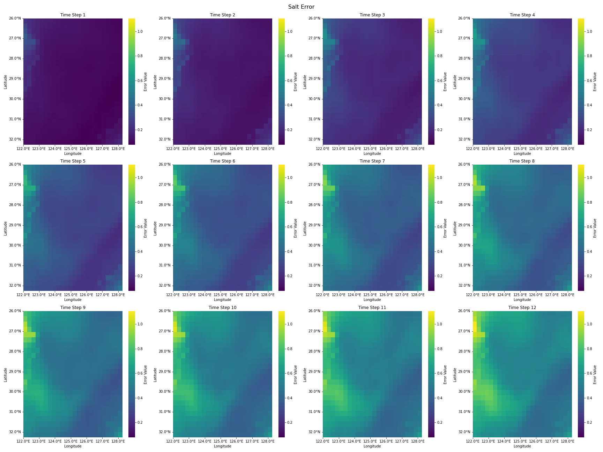

# val_data
## data_process.py
（1）功能：用于读取数据、增加时间戳维度、创建数据的pkl文件、创建index的pkl文件、创建mean和std的pkl文件等。

（2）注意：短期或长期预测需要改下面参数

HISTORY_SEQ_LEN = 12

FUTURE_SEQ_LEN = 12

（3）数据生成：
```
python data_process.py
```
# model.py
示例模型
# train.py
（1）注意：短期或长期预测需要改下面参数

parser.add_argument("--input_len", type=int, default=12, help="input_len")

parser.add_argument("--output_len", type=int, default=12, help="out_len")

（2）训练示例：
```
python train.py --channels 64 --learning_rate 0.001
```
# test.py
取logs中的模型文件，导入数据并将真实结果、预测存于logs/.../.pt文件中
# plot.ipynb
取logs中的pt文件，绘制误差图，存于logs/.../.png
示例图：

