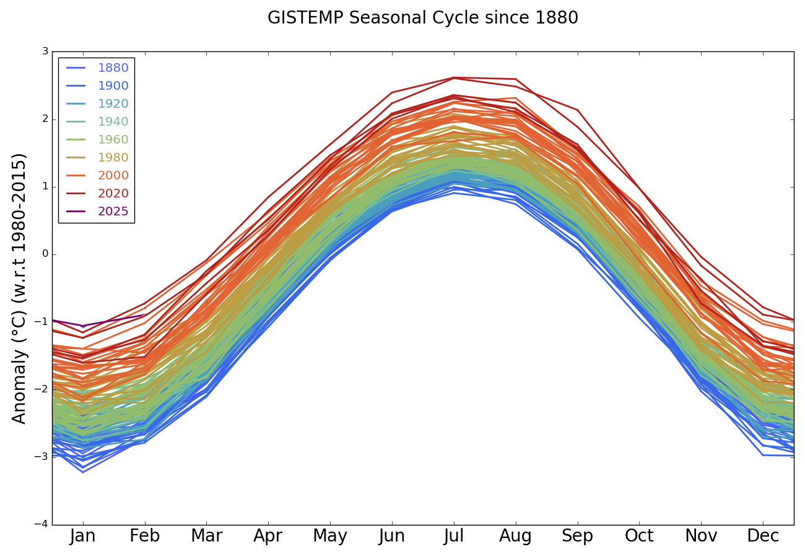
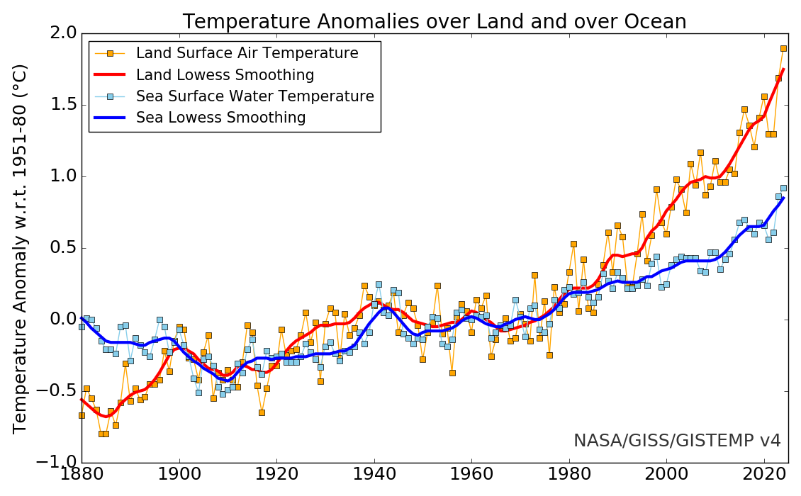
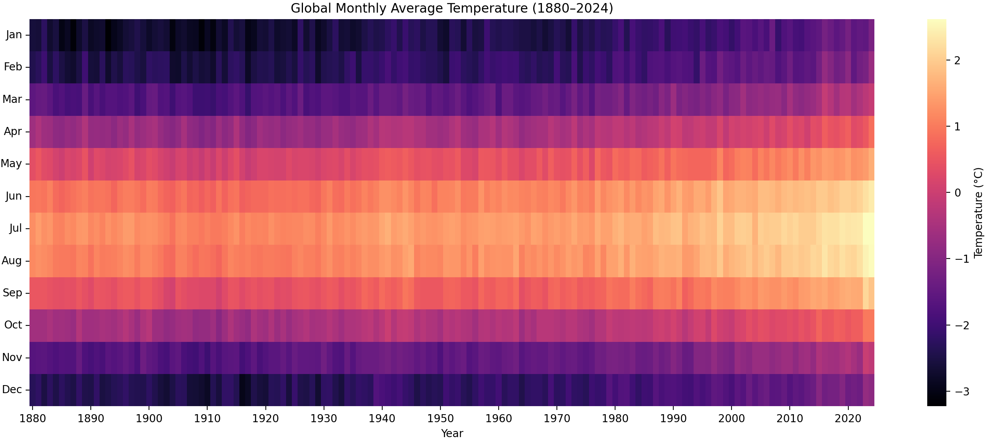

图1

图2

Annual (thin lines) and five-year lowess smooth (thick lines) for the temperature anomalies (vs. 1951-1980) averaged over the Earth’s land area and sea surface temperature anomalies (vs. 1951-1980) averaged over the part of the ocean that is free of ice at all times (open ocean).

图3

这张图是和图1的使用数据是一样的，但是另一种表现方式

图1和图2来自于NASA

https://data.giss.nasa.gov/

图3的数据来自NASA，但是是自己绘制

图4
Niño 3.4 指数是衡量 厄尔尼诺（El Niño）和拉尼娜（La Niña） 现象最常用、最权威的一个海洋温度指标。

Niño 3.4 区域是赤道太平洋上的一个特定区域，地理范围为：

纬度：5°S 到 5°N

经度：170°W 到 120°W

Niño 3.4 指数是这个区域内 海表温度异常值（SST Anomaly） 的月度平均：

正值（> +0.5°C）：说明该区域比常年偏暖，可能是 厄尔尼诺

负值（< -0.5°C）：说明该区域比常年偏冷，可能是 拉尼娜

ONI（Oceanic Niño Index） 是基于 Niño 3.4 的标准：

如果 连续3个月 的 Niño 3.4 指数 > +0.5°C：认定为厄尔尼诺事件

如果 < -0.5°C：拉尼娜事件

图4：
https://origin.cpc.ncep.noaa.gov/products/analysis_monitoring/ensostuff/ONI_v5.php
